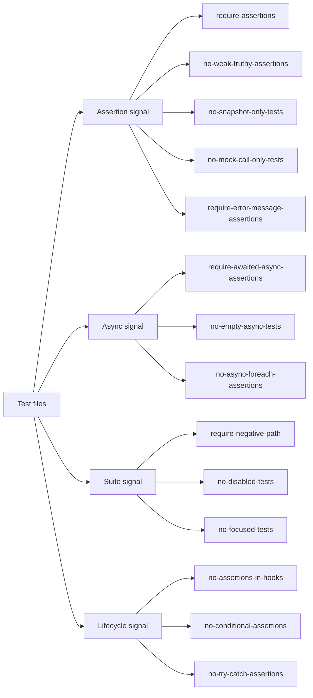

# Rule Signal Map

This chart shows the main weak-test signals covered by the current rule catalog.

```mermaid
flowchart LR
    tests[Test files] --> assertions[Assertion signal]
    tests --> async[Async signal]
    tests --> suites[Suite signal]
    tests --> lifecycle[Lifecycle signal]

    assertions --> requireAssertions[require-assertions]
    assertions --> weakTruthy[no-weak-truthy-assertions]
    assertions --> snapshots[no-snapshot-only-tests]
    assertions --> mocks[no-mock-call-only-tests]
    assertions --> messages[require-error-message-assertions]

    async --> awaited[require-awaited-async-assertions]
    async --> emptyAsync[no-empty-async-tests]
    async --> asyncForEach[no-async-foreach-assertions]

    suites --> negative[require-negative-path]
    suites --> disabled[no-disabled-tests]
    suites --> focused[no-focused-tests]

    lifecycle --> hooks[no-assertions-in-hooks]
    lifecycle --> conditional[no-conditional-assertions]
    lifecycle --> tryCatch[no-try-catch-assertions]
```
