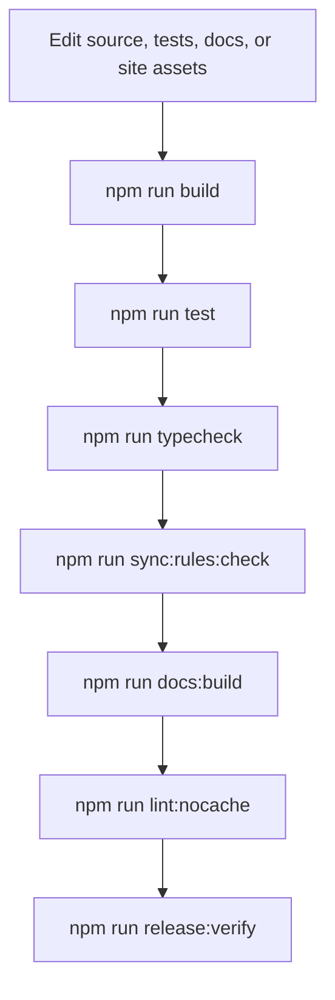

# Validation Pipeline

Use this flow when changing rule behavior, docs, presets, or site assets.

`release:verify` is the final check because it exercises package build, lint,
typecheck, tests, docs link validation, sync validation, and package validation
in the same path used before publishing.
